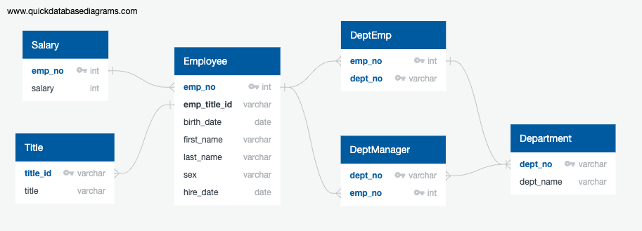

# Database Revival Project 

## Background
Two weeks into my new role as a data engineer at Pewlett Hackard, a fictional company, I've been tasked with a challenging and exciting project: to reconstruct and analyze the company's employee database from the 1980s and 1990s, using only six remaining CSV files. This project will encompass the full spectrum of my data engineering skills, including data modeling to design the database structure, data engineering to create and populate SQL tables, and data analysis to extract meaningful insights from this historical data. This endeavor not only tests my technical abilities but also provides a unique window into the company's past workforce dynamics.
## Objective
The primary goal of the "Database Revival Project" is to meticulously reconstruct and analyze the historical employee data of a fictional company from the 1980s and 1990s. This comprehensive project is structured into three distinct phases: data modeling, data engineering, and data analysis.

### Data Modeling
The initial phase focuses on understanding the structure and relationships within the data. By inspecting the six CSV files provided, I will create an Entity Relationship Diagram (ERD) to visually map out the connections and dependencies between different data tables. This diagram will be crafted using tools like QuickDBD, offering clarity and precision in the design process.

### Data Engineering
In the second phase, the project transitions into the technical realm of database creation and management. My tasks include:

* **Schema Development**: Designing a table schema for each CSV file. This involves specifying data types, primary keys, foreign keys, and other constraints to ensure data integrity and relational coherence.

* **Primary Key Identification**: Ensuring each table has a unique primary key. If a single column does not suffice for uniqueness, I will create a composite key combining multiple columns.

* **Sequential Table Creation**: Constructing tables in an order that respects foreign key dependencies, thereby ensuring a smooth and error-free database structure.

* **Data Importation**: Migrating data from the CSV files into their respective tables within the SQL database, transforming unstructured data into a structured format ready for analysis.

### Data Analysis
The final phase is dedicated to extracting actionable insights from the data. This involves executing a series of SQL queries to:

* Retrieve detailed employee information including salaries.
* Identify employees hired in a specific year (1986).
* List department managers with associated details.
* Associate employees with their respective departments.
* Filter employees by specific name criteria (e.g., first name 'Hercules' and last names starting with 'B').
* Enumerate employees in specific departments (Sales, Development).
* Analyze the frequency distribution of employee last names.

Through these phases, the "Database Revival Project" aims to not only reconstruct a piece of the company's historical data but also to glean meaningful insights that reflect the employee dynamics and trends during the 1980s and 1990s.
## Implementation
In the Implementation section of this project, we systematically bring to life the Database Revival Project by executing a series of well-defined steps. This process encompasses the practical application of data engineering principles, from the initial setup of database schemas to the intricate tasks of data importation and query execution, ensuring a seamless transition from raw data to valuable insights.
### Data Modeling
The data modeling phase is the cornerstone of the Database Revival Project, where we begin to shape the raw data into a structured and organized database. This process starts with a thorough examination of the contents within six CSV files, each representing a distinct segment of the historical employee database from the 1980s and 1990s.

Utilizing [QuickDBD](https://www.quickdatabasediagrams.com/) for its intuitive design capabilities, we construct an Entity Relationship Diagram (ERD) to visually map out the data relationships. 

In the design of our database schema, each entity is meticulously structured to capture specific segments of our data:

* **Employee**: This entity captures personal and employment information, with `emp_no` (employee number) serving as the unique identifier, hence the primary key.

* **Department**: It details the organizational structure, with `dept_no` (department number) as the primary key, ensuring each department is uniquely identified.

* **DeptEmp**: Acting as a link table, it aligns employees with their respective departments. Here, a composite key made up of `emp_no` and `dept_no` is used, as the combination uniquely identifies each record. `emp_no` and `dept_no` in this table are also foreign keys, referencing the Employee and Department tables, respectively.

* **DeptManager*: This table maps out the leadership structure, connecting departments to their managers. Similar to DeptEmp, it uses a composite key of `emp_no` and `dept_no` for unique identification. Both these fields are foreign keys as well, with emp_no referencing the Employee table and dept_no referencing the Department table.

* **Title**: This entity catalogs possible employee roles, with `title_id` as the primary key, uniquely identifying each job title.

* **Salary**: It tracks compensation figures and has a primary key of `emp_no`. In this table, `emp_no `serves as a foreign key referencing the Employee table.

These primary, foreign, and composite keys across each table play a crucial role in preserving data integrity and facilitating efficient data querying in our relational database. This carefully constructed diagram sets the stage for the Data Engineering phase, guiding the creation and interrelation of SQL tables.
### Data Engineering 
In the Data Engineering phase, we operationalize our data model by constructing and populating PostgreSQL tables, carefully defining data types, primary and foreign keys, and constraints to ensure data integrity and seamless inter-table relationships, paving the way for robust data analysis.

To set up a PostgreSQL session in pgAdmin and prepare for table creation:

1. **Download pgAdmin**: Visit the [official pgAdmin download page](https://www.pgadmin.org/), select the version compatible with your operating system, and follow the instructions to install it.

2. **Open pgAdmin**: Launch pgAdmin from your computer; it will typically open in a new browser window or tab.

3. **Add New Server**: In the pgAdmin dashboard, right-click on `Servers` in the browser tree and select `Create` > `Server`.

4. **Configure Server Connection**:
	* In the `Create - Server` dialog, go to the `General` tab, and give your connection a meaningful name.
	* Move to the `Connection` tab, input your PostgreSQL server’s details: host name/address (often `localhost`), port (default `5432`), maintenance database (typically `postgres`), username, and password.
	* Click `Save` to establish the connection.

5. **Access or Create Database**: Expand the newly added server, navigate to `Databases`. For a new database, right-click on `Databases`, select `Create` > `Database`, give it a name, and save.

6. **Prepare for Table Creation**:
	* Select the database, right-click on `Schemas` > `public` > `Tables`, choose `Create` > `Table`.

With pgAdmin installed and configured, we are now ready to create the tables for our PostgreSQL database as outlined in our data model.
